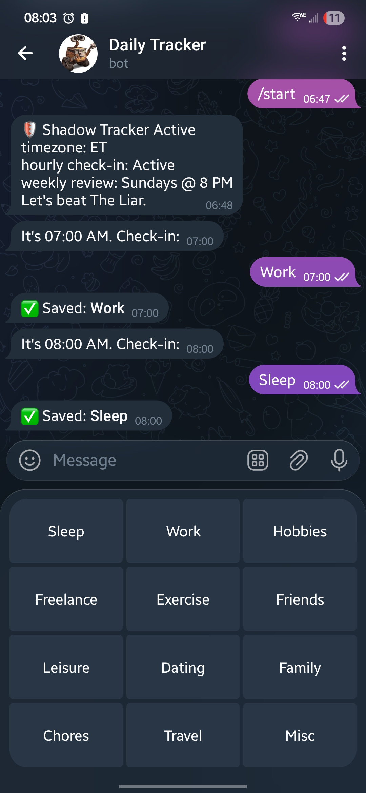
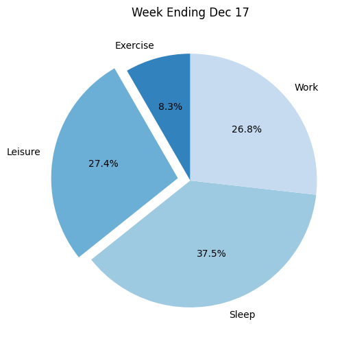
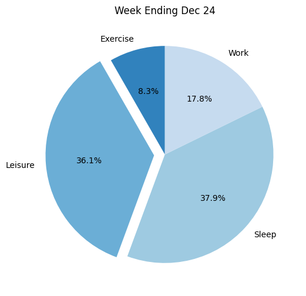
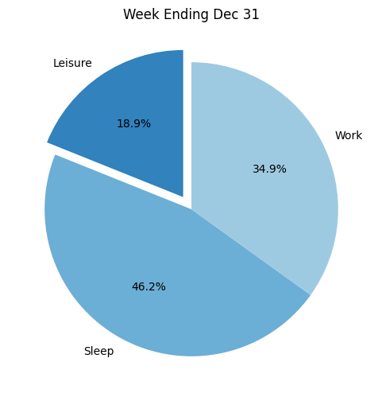

# 🛡️ Shadow-Tracker: Live Logic Demo

## Actual screenshot of Telegram Bot

> Generated using the `bot-runtime` container logic against a simulated dataset.

# Simulated Accountability Partner Analysis Demo

## 📅 Week 1

**⚠️ Integrity Violations Detected:**
- 🔴 **Priority Neglect:** ['Hobbies', 'Freelance']
- 🟠 **High Avoidance:** True missed check-ins

## 📅 Week 2

**⚠️ Integrity Violations Detected:**
- 🔴 **Priority Neglect:** ['Hobbies', 'Freelance']
- 🟠 **High Avoidance:** True missed check-ins
- 🟡 **Discipline Breach:** Leisure during work hours

## 📅 Week 3

**⚠️ Integrity Violations Detected:**
- 🔴 **Priority Neglect:** ['Exercise', 'Hobbies', 'Freelance']
- 🟠 **High Avoidance:** True missed check-ins

## 📅 Week 4

**⚠️ Integrity Violations Detected:**
- 🔴 **Priority Neglect:** ['Hobbies', 'Freelance']
- 🟠 **High Avoidance:** True missed check-ins

---
## 🧠 Monthly Identity Report
**Subject:** DEMO_USER_01 | **Status:** INCONSISTENT

**Narrative Analysis:**
The data describes an user capable of high discipline (Week 1, 4) but susceptible to **stress-induced regression**. In Week 3, a failure to regulate work hours led to an 'Avoidance Spiral' (400% increase in missed logs). Recovery in Week 4 demonstrates resilience, but the trigger remains unaddressed.
